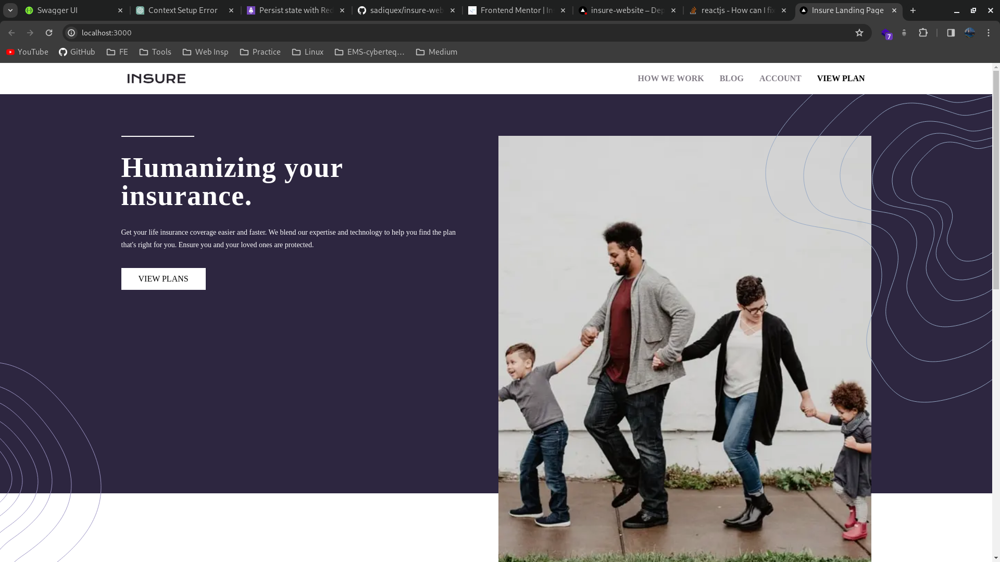
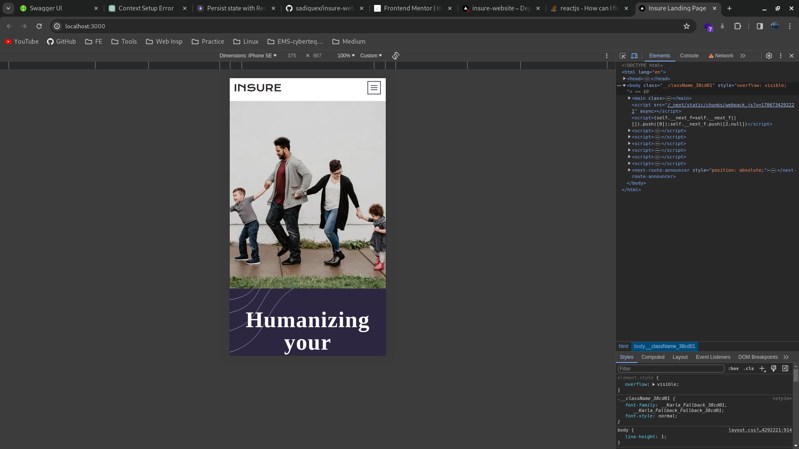
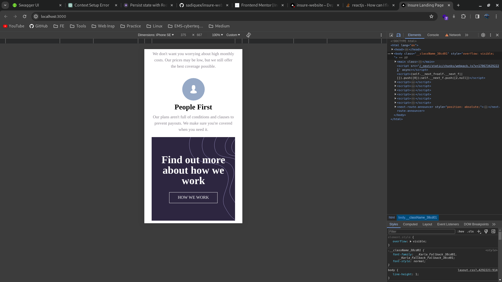

## Insure website - from Frontend Mentor

## Table of contents

- [Overview](#overview)
  - [The challenge](#the-challenge)
  - [Screenshot](#screenshot)
  - [Links](#links)
- [My process](#my-process)
  - [Built with](#built-with)
  - [What I learned](#what-i-learned)

## Overview

### The challenge

Users should be able to:

- View the optimal layout for the site depending on their device's screen size
- See hover states for all interactive elements on the page

### Screenshot

### Links

- Solution URL: [Solution URL](https://github.com/sadiquex/insure-website)
- Live Site URL: [Live URL](https://insure-website-kh3rickcd-sadiquex.vercel.app/)

### What I learned

- Basic types in TypeScript

## My Process

### Built with

- Nextjs 14
- TypeScript
- TailwindCSS
- Framer motion
